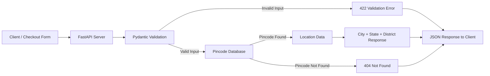

# Pincode Lookup API

A FastAPI-based backend service that automatically retrieves location details such as city, state, and district from an Indian pincode.

The API is designed for **Direct-to-Consumer (D2C) checkout systems**, where customers enter their pincode during checkout. Instead of manually entering location information, the application can use this API to automatically populate the relevant address fields, reducing friction and typing errors.

## Project Overview

During an e-commerce checkout process, a customer enters their pincode. The frontend sends the pincode to the FastAPI backend, where it is validated using Pydantic.

If the pincode is valid and exists in the database, the API returns the corresponding location details.

If the pincode is invalid, the API returns a validation error. If the pincode has a valid format but does not exist in the database, the API returns a `404 Not Found` response.

### Request Flow



### Request Lifecycle

```text
Client Checkout Form
        |
        v
   FastAPI Server
        |
        v
 Pydantic Validation
      /       \
   Invalid     Valid
      |          |
      v          v
  422 Error   Pincode Database
                  /      \
               Found    Not Found
                 |          |
                 v          v
          Location Data   404 Error
                 |
                 v
           JSON Response
```

## Features

- Pincode-based location lookup
- Automatic city, state, and district retrieval
- Pincode format validation
- Custom validation using Pydantic `field_validator`
- Custom exception classes
- Custom exception handlers
- `404 Not Found` handling for unavailable pincodes
- `422 Unprocessable Entity` validation responses
- Single pincode lookup
- Bulk pincode lookup
- Maximum limit of 20 pincodes per bulk request
- Structured JSON responses
- FastAPI automatic API documentation

## Technologies Used

### Python

Used as the primary programming language for implementing the backend logic.

### FastAPI

Used to build the REST API and define HTTP endpoints.

### Pydantic

Used for request validation and response models.

### Uvicorn

Used as the ASGI server to run the FastAPI application.

### In-Memory Pincode Database

A Python dictionary is currently used to store pincode and location information.

## Project Structure

```text
Pincode-Lookup-API/
│
├── main.py
├── models.py
├── exceptions.py
├── data.py
├── requirements.txt
├── README.md
└── .gitignore
```

### File Responsibilities

| File               | Responsibility                           |
| ------------------ | ---------------------------------------- |
| `main.py`          | FastAPI application and API endpoints    |
| `models.py`        | Pydantic request and response models     |
| `exceptions.py`    | Custom exceptions and exception handlers |
| `data.py`          | Pincode and location data                |
| `requirements.txt` | Python dependencies                      |
| `README.md`        | Project documentation                    |

## API Endpoints

### 1. Health Check

```http
GET /
```

Returns a basic response to verify that the API is running.

Example response:

```json
{
  "message": "Pincode Lookup"
}
```

---

### 2. Single Pincode Lookup

```http
GET /pincode/{code}
```

Looks up a single pincode and returns its location details.

Example:

```http
GET /pincode/500001
```

Example response:

```json
{
  "pincode": "500001",
  "city": "Hyderabad",
  "state": "Telangana",
  "district": "Hyderabad"
}
```

### Validation

The pincode must:

- Contain exactly 6 characters
- Contain only digits

Example of an invalid request:

```http
GET /pincode/50001
```

This results in a validation error.

If the pincode has a valid format but does not exist in the database, the API returns:

```text
404 Not Found
```

---

### 3. Bulk Pincode Lookup

```http
POST /pincode/bulk
```

Allows multiple pincodes to be checked in a single request.

Example request:

```json
{
  "pincodes": ["500001", "492001", "751001"]
}
```

Example response:

```json
{
  "status": "Success",
  "found": 3,
  "not_found": 0,
  "results": [
    {
      "pincode": "500001",
      "city": "Hyderabad",
      "state": "Telangana",
      "district": "Hyderabad"
    }
  ],
  "missing": []
}
```

The bulk API validates that:

- At least one pincode is provided
- A maximum of 20 pincodes can be submitted
- Every pincode contains exactly 6 digits

## Error Handling

The project uses custom exception classes to provide clean and meaningful error responses.

### Invalid Pincode

If the pincode format is invalid, FastAPI/Pydantic returns a validation error.

```text
HTTP 422 Unprocessable Entity
```

Example:

```json
{
  "detail": [
    {
      "msg": "Pincode must be exactly 6 digits."
    }
  ]
}
```

### Pincode Not Found

If the pincode contains six digits but is not present in the database:

```text
HTTP 404 Not Found
```

Example:

```json
{
  "error": "pincode_not_found",
  "message": "No location for pincode : 999999",
  "pincode": "999999"
}
```

## Validation

Pydantic validators are used to validate incoming data before it reaches the API logic.

For bulk requests, validation checks:

```text
1. At least one pincode
2. Maximum 20 pincodes
3. Every pincode must contain exactly 6 digits
```

This prevents invalid data from reaching the lookup logic.

## API Documentation

FastAPI automatically provides interactive API documentation.

After starting the application, open:

```text
http://127.0.0.1:8000/docs
```

Swagger UI can be used to test the endpoints directly from the browser.

Alternative documentation:

```text
http://127.0.0.1:8000/redoc
```

## Installation and Setup

### 1. Clone the Repository

```bash
git clone <your-repository-url>
```

Move into the project directory:

```bash
cd Pincode-Lookup-API
```

### 2. Create a Virtual Environment

On Windows:

```bash
python -m venv venv
```

Activate it:

```bash
venv\Scripts\activate
```

On macOS/Linux:

```bash
python3 -m venv venv
source venv/bin/activate
```

### 3. Install Dependencies

```bash
pip install -r requirements.txt
```

### 4. Run the Application

```bash
uvicorn main:app --reload
```

The server will start at:

```text
http://127.0.0.1:8000
```

### 5. Test the API

Open:

```text
http://127.0.0.1:8000/docs
```

Use Swagger UI to test the available endpoints.

## Learning Outcomes

Through this project, I learned and implemented:

- Pydantic `field_validator` for input validation
- Custom exception classes
- Custom exception handlers
- GET and POST HTTP requests
- JSON request bodies
- Path parameters
- Request body validation
- Difference between path parameters and request bodies
- Clean and structured error-response patterns
- FastAPI routing
- Pydantic request and response models
- API documentation using Swagger/OpenAPI
- Modular backend project structure

## Future Improvements

The current project uses an in-memory dictionary for pincode data. It can be extended into a production-ready service by adding:

- PostgreSQL/MySQL database
- SQLAlchemy or SQLModel
- Authentication and authorization
- Logging and middleware
- Automated unit and integration tests
- Redis caching
- Docker containerization
- Cloud deployment
- Larger and regularly updated pincode dataset

## Project Purpose

This project demonstrates how a backend API can be used in a real-world D2C/e-commerce checkout workflow to reduce manual data entry and improve the customer experience.

It focuses on practical FastAPI concepts such as **API routing, validation, request handling, response models, and custom exception handling**.
